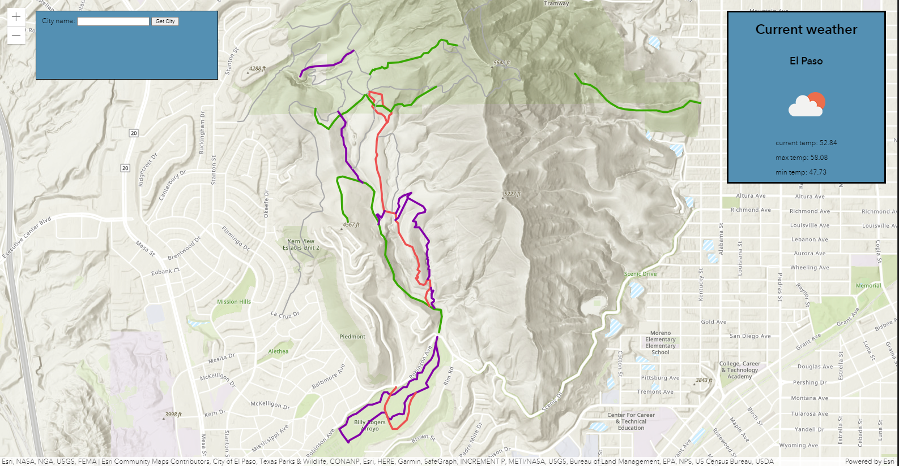

# Bike-Adventure-Planning
## Planner for a recreational bike trip

## User Story
As a cyclist,
I want to plan a good route,
So that it will be an enjoyable ride with my preferences.

## The planner will have the following features
* The planner will get the user's desired approximate location for a ride.
* The planner will display a map with the proposed route outlined.
* The planner will give current weather conditions for the intended day.
* The planner will get the user's desired radius of location from the starting point.
* The planner will get the user's desired length of trip
* The planner will get the user's preference, if any, for bike lanes
* The planner will get the user's preference for traffic conditions and advise about current traffic conditions.
* The planner will recommend points of interest along the route.

## Screenshot of the app

## APIs
* https://services3.arcgis.com/GVgbJbqm8hXASVYi/arcgis/rest/services/Trailheads/FeatureServer/0
* https://services3.arcgis.com/GVgbJbqm8hXASVYi/arcgis/rest/services/Trails/FeatureServer/0
* https://services3.arcgis.com/GVgbJbqm8hXASVYi/arcgis/rest/services/Parks_and_Open_Space/FeatureServer/0
* https://services3.arcgis.com/opQwubFkkN0h4iC4/arcgis/rest/services/trollbridge86468/FeatureServer/0
* https://services3.arcgis.com/opQwubFkkN0h4iC4/arcgis/rest/services/3493/FeatureServer/0
* https://services3.arcgis.com/opQwubFkkN0h4iC4/arcgis/rest/services/3296/FeatureServer/0
* https://services3.arcgis.com/opQwubFkkN0h4iC4/arcgis/rest/services/3309/FeatureServer/0
* https://services3.arcgis.com/opQwubFkkN0h4iC4/arcgis/rest/services/cotrails/FeatureServer/0
 
* openweathermap.org/current

## Repository
https://github.com/CChampness/Bike-Adventure-Planning

## Deployed URL
https://CChampness.github.io/Bike-Adventure-Planning

## Rough task breakdown
* Evan: ArcGIS research and map import
* Roberto: weather imnport and styling
* Chris: weather import and map iport integration

## Future development
* The current implementation is an MVP (Minimal Viable Product)
* Still to be completed are to receive more detailed input from the user about the desired trip, including points of interest, length of trip, and traffic conditions.
* Still to be done is to give more detailed information about the displayed routes.

